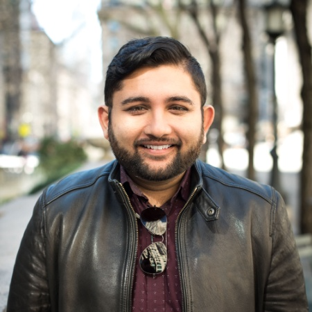

      

I’m a Full Stack Web Developer with a background in Customer Support Management and Training. In September 2018 I began my journey through the Columbia University Coding Bootcamp. This is where I honed my skills as a web developer and fell in love with all aspects of development. Beyond my Bootcamp experience; I continued to expand my learning and I now work professionally as a Software Engineer. Aside from that I am also a founder of a Mental Health Startup called Whimser.

I love working with JavaScript, CSS, HTML, NodeJS, SQL, MongoDB, React and GraphQL. My plan is to also slowly expand into more backend technologies to further expand on my knowledge.

In my free time I love to play video games, watch Anime, write blogs and tutorials, rap, record music, and spend time with my daughter. 

